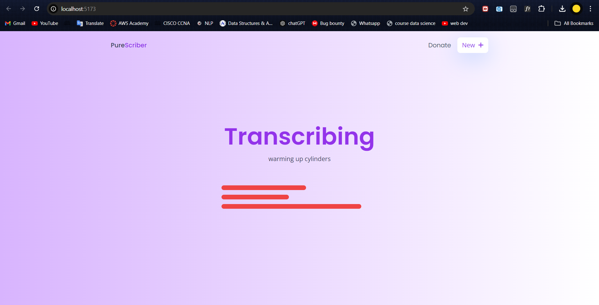
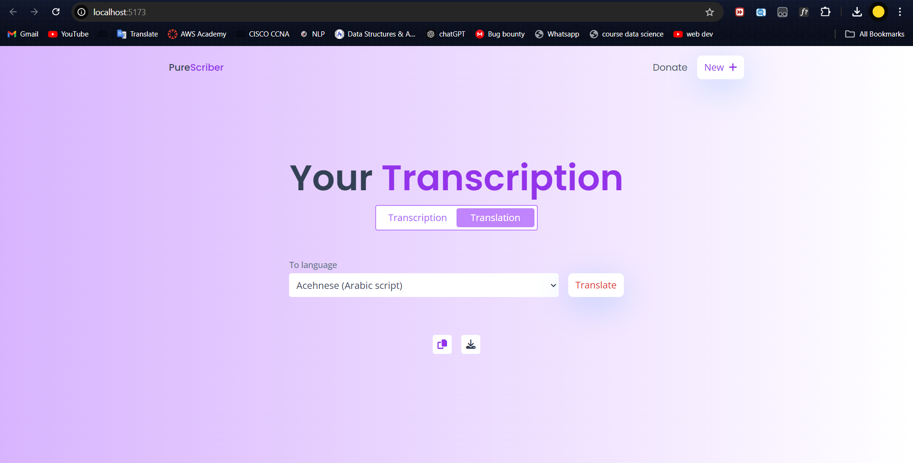

# Purescriber

This project implements a web application for real-time transcription and translation using advanced machine learning models. The application leverages the Whisper model for automatic speech recognition and a translation model for language conversion.

## Table of Contents

- [Tech Stack](#tech-stack)
- [Data Flow Diagram](#data-flow-diagram)
- [Models](#models)
- [Components](#components)
- [Deployment](#deployment)
- [Screenshots](#screenshots)
- [User Input and Processing](#user-input-and-processing)

## Tech Stack

- **Frontend**: 
  - **React.js**: A JavaScript library for building user interfaces.
  - **Tailwind CSS**: A utility-first CSS framework for styling.
- **Machine Learning Models**: 
  - **Whisper**: OpenAI's model for automatic speech recognition (ASR).
  - **NLLB (No Language Left Behind)**: A model for language translation.
- **Web Workers**: 
  - Used for handling background tasks such as transcription and translation, ensuring a responsive UI.

## Data Flow Diagram

Here’s a visual representation of how data flows between different components in the project:  
  
  

### Flow Explanation
- **User Input File**: The process begins with the user providing an audio file.
- **Process**: The audio file is processed to extract audio data.
- **Read Audio Data**: The worker reads the audio data from the input file.
- **Send Audio Data to Worker**: The audio data is sent to the Whisper worker for transcription.
- **Worker Whisper Model**: The worker utilizes the Whisper model to transcribe the audio data.
- **Response**: The worker responds with one of the following states:
   - **Success**: The output state is updated with the transcription result.
   - **Downloading**: Indicates that the transcription process is in progress.
   - **Loading**: Indicates that the application is in a loading state while processing.
   - **Inference Done**: Signals that the transcription is complete.
- **Update Output State**: The application updates the UI to display the transcription output in the information component.
- **Show Transcribing Component**: If in the downloading state, the transcribing component is displayed to inform the user of progress.
- **Show Loading State**: The loading state is shown while waiting for transcription results.
- **Set Finished State**: Finally, the finished state is set, and the output is displayed to the user.

## Models

### 1. Whisper Model (`whisper.worker.js`)

- **Purpose**: This worker handles automatic speech recognition (ASR). It listens for audio input, processes it using the Whisper model, and returns the transcribed text.
- **Key Features**:
  - Utilizes the `@xenova/transformers` library for accessing the Whisper model.
  - Processes audio in chunks, providing real-time updates on transcription progress.
  - Implements callbacks to manage loading states and report progress back to the main thread.

### 2. Translation Model (`translate.worker.js`)

- **Purpose**: This worker is responsible for translating the transcribed text into the desired language.
- **Key Features**:
  - Uses the NLLB model for language translation, allowing users to select a target language.
  - Manages states such as initiating translation, tracking progress, and completing the translation.
  - Provides real-time feedback on translation updates through the use of callback functions.
  - 
  

## Components

The application is composed of several React components that manage different aspects of the user interface:

1. **`Information.jsx`**:
   - Handles the main display of transcriptions and translations.
   - Contains buttons for switching between transcription and translation views, as well as for copying and downloading results.
   - Uses Web Workers to manage background tasks for transcription and translation.

2. **`Transcribing.jsx`**:
   - Displays the status of the transcription process.
   - Shows loading indicators and messages to inform users about the transcription state.

3. **`Translation.jsx`**:
   - Allows users to select a target language for translation.
   - Displays the transcribed text and provides a button to initiate the translation process.

4. **`Transcription.jsx`**:
   - Responsible for rendering the transcribed text in the UI.
   - Keeps the code modular by separating the transcription display logic.

## Deployment

You can access the live application here: [Deployment Link](https://purescriber.netlify.app/) 

## Screenshots

Here are some screenshots of the application in action:  
  
  
  
  
 

## User Input and Processing

The user interaction and processing flow are as follows:

- **User Input**: The user can provide either a file or an audio stream as input.
- **Process**: The application processes the audio data.
- **Send Audio Data to Worker**: The processed audio data is then sent to a Web Worker for further processing.
- **Worker (Whisper Model)**: The Web Worker runs the Whisper model on the provided audio input.
- **Response**: The worker sends back various types of responses:
   - **Success**: Indicates successful processing.
   - **Downloading**: Indicates that the data is being downloaded.
   - **Loading**: Indicates that the application is in a loading state.
   - **Inference Done**: Indicates that the processing is complete.
- **Output Handling**: Based on the type of response received, the application updates its state accordingly and displays the appropriate components (like output or loading indicators).

